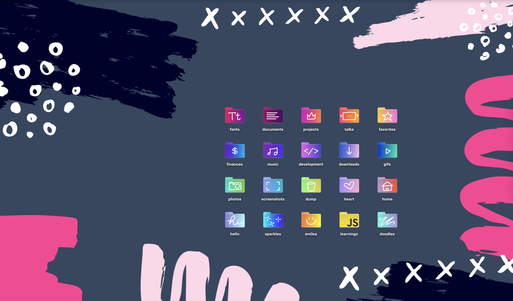
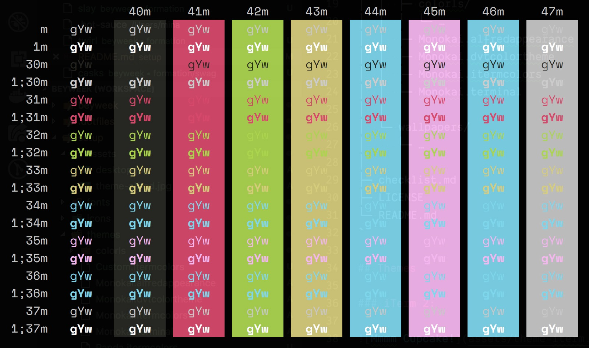
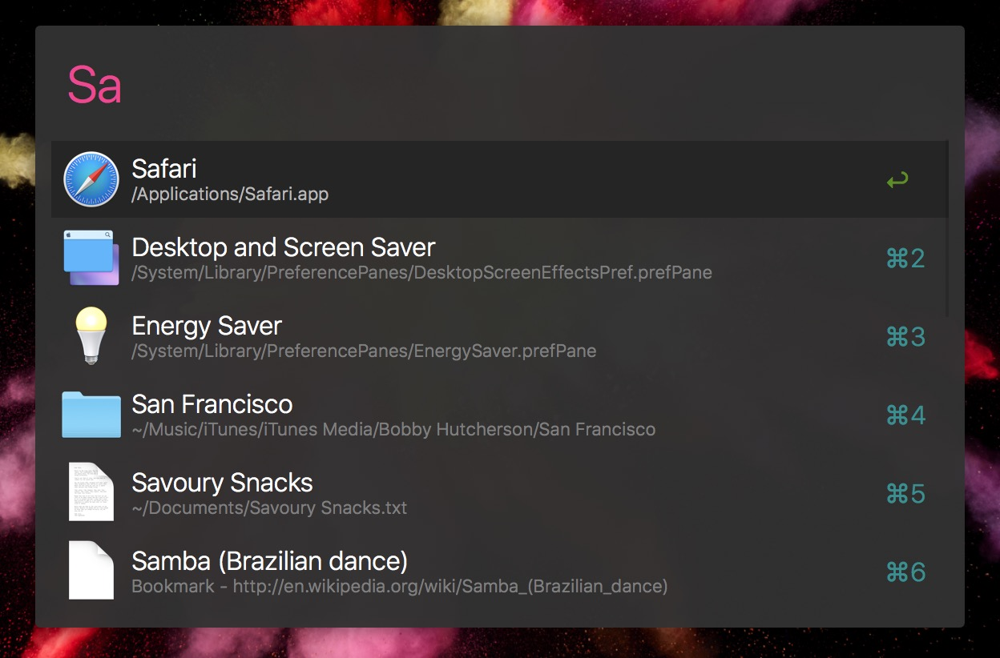

# The Setup

Documenting my system setup for posterity.



How to use: Open an issue each time I need to setup a new machine, paste [the checklist](checklist.md) from this readme, and follow the steps.

## Contents

```bash
setup/
│  ├─ assets/
│  ├─ fonts/
│  ├─ icons/
│  │  └─ folders--gradient/
│  │
│  ├─ themes/
│  │  ├─ colorls/
│  │  │  └─ …
│  │  ├─ Custom.itermcolors
│  │  └─ Monokai.alfredappearance
│  │
│  └─ wallpapers/
│     └─ …
│
├─ checklist.md
├─ LICENSE
└─ README.md
```

## Themes

### iTerm 2:



### Alfred:



## Thanks
- Inspiration from Joel's [setup repo](https://github.com/jglovier/my-setup)
- Gradient folders by [Una](https://github.com/una/gradient-folders)